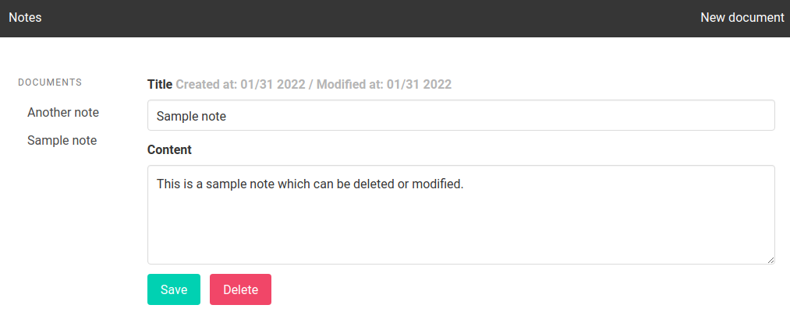

# djanote

## Description

A simple note-taking app made using **Django**, 
useful for creating new notes 
as well as modifiying or deleting  existing ones.

## Usage

```console
$ python manage.py runserver
```

## Screenshots

